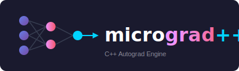

<p align="center">
  
</p>


<h1 align="center">microgradpp</h1>

<p align="center">
  <strong>A pure C++ machine learning library inspired by Andrej Karpathy's micrograd</strong>
</p>

<p align="center">
  <a href="#features">Features</a> •
  <a href="#getting-started">Getting Started</a> •
  <a href="#examples">Examples</a> •
  <a href="#usage">Usage</a> •
  <a href="#contributing">Contributing</a>
</p>

<p align="center">
  
  
  
  
</p>

---

## Are you tired of using outdated hard-to-use C++ machine learning libraries???

Welcome to **microgradpp**! This repository is inspired by Andrej Karpathy's [micrograd](https://github.com/karpathy/micrograd). microgradpp is a pure C++ machine learning library designed to make machine learning accessible to everyone.

<p align="center">
  
</p>

---

## What is microgradpp?

**microgradpp** (micrograd++) is a C++ implementation of an automatic differentiation (autograd) engine with a neural network library built on top. It implements backpropagation (reverse-mode autodiff) over a dynamically built computational graph and provides tools to build and train neural networks.

### Why microgradpp?

| Feature | microgradpp | Python micrograd |
|---------|-------------|------------------|
| Language | Modern C++17 | Python |
| Performance | Fast (compiled) | Interpreted |
| Computer Vision | ✅ OpenCV support | ❌ |
| Header-Only Option | ✅ | ✅ |

---

## Features

* ✅ **Pure C++**: Entirely implemented in C++ for high performance
* ✅ **Inspired by micrograd**: Brings the simplicity and educational value of micrograd to the C++ ecosystem
* ✅ **Accessible Machine Learning**: Designed to be easy to use, even for those new to machine learning or C++
* ✅ **Computer Vision Support**: OpenCV integration for image-based neural networks
* ✅ **Header-Only Option**: Can be used as a header-only library
* ✅ **Tensor Class**: Simplified data loading and manipulation
* ✅ **Multiple Activation Functions**: ReLU, Tanh, Sigmoid, and more

---

## Getting Started

### Prerequisites

* **CMake**: Version 3.15 or higher
* **C++ Compiler**: Supports C++17 standard
* **OpenCV**: For visualization (optional)

### Building the Library

1. **Clone the repository:**
   ```bash
   git clone https://github.com/gautam-sharma1/microgradpp.git
   cd microgradpp
   ```

2. **Create a build directory:**
   ```bash
   mkdir build
   cd build
   ```

3. **Configure the project with CMake:**

   Build microgradpp only:
   ```bash
   cmake ..
   ```

   Build with examples and tests:
   ```bash
   cmake .. -DBUILD_EXAMPLES=ON -DBUILD_TESTS=ON
   ```

   Release build:
   ```bash
   cmake .. -DCMAKE_BUILD_TYPE=Release
   ```

4. **Build the project:**
   ```bash
   make
   ```

### Using as Header-Only Library

microgradpp is also available as a header-only library. Simply include the headers from `include/` in your project:

```cpp
#include "microgradpp/Value.hpp"
#include "microgradpp/MLP.hpp"
```

### Running the Example

After building, run the provided example:
```bash
./m++
```

---

## Usage

Here's a brief example of how to use microgradpp:

```cpp
#include <iostream>
#include "Value.h"

int main() {
    // Create values
    auto a = microgradpp::Value::create(2.0);
    auto b = microgradpp::Value::create(3.0);
    
    // Build computation graph
    auto c = a * b;
    
    // Backpropagation
    c->backProp();
    
    std::cout << "a->grad: " << a->grad << std::endl;  // 3.0
    std::cout << "b->grad: " << b->grad << std::endl;  // 2.0

    return 0;
}
```

---

## Examples

Head over to the `examples/` directory to explore various examples. To build examples:

```bash
cd build
cmake -DBUILD_EXAMPLES=ON .. && make
cd examples
./example_mlp  # Run MLP example
```

### Multi-Layer Perceptron (MLP)

A simple multi-layer perceptron defined in **mlp.cpp**. Running it for 50 iterations:

<p align="center">
  
</p>

### Computer Vision Example 🐕

The example in **images.cpp** trains a neural network to learn a German Shepherd puppy face:

<p align="center">
  
</p>

---

## Project Structure

```
microgradpp/
├── include/          # Header files
├── examples/         # Example programs
├── tests/            # Unit tests
├── public/           # Images and assets
├── scripts/          # Utility scripts
├── CMakeLists.txt    # CMake configuration
├── main.cpp          # Main example
└── README.md
```

---

## API Overview

### Value Class

The core building block for automatic differentiation:

```cpp
auto x = microgradpp::Value::create(2.0);
auto y = microgradpp::Value::create(3.0);
auto z = x * y + x->pow(2);
z->backProp();
// x->grad and y->grad now contain gradients
```

### Neural Network Classes

```cpp
// Create a Multi-Layer Perceptron
// Input: 3 features, Hidden: 4 neurons, Output: 1 neuron
MLP model(3, {4, 4, 1});

// Forward pass
auto output = model(input_data);

// Training
model.zeroGrad();
loss->backProp();
// Update weights...
```

---

## Contributing

We welcome contributions to microgradpp! Here are areas where you can help:

### TODO

* ~~**Modify CMakeLists to Add a Flag to Build Tests**~~: ✅ Done
* ~~**Make a Tensor Class**~~: ✅ Done
* ~~**Add an Activation Function Enum or Class**~~: ✅ Done
* ~~**Make an Abstract Base Class for Layer and Value**~~: ✅ Done
* **CI/CD Pipeline**: Develop a pipeline using GitHub Actions
* **More Examples**: Add tutorials and use cases
* **Python Interface**: Create Python bindings

### How to Contribute

1. Fork the repository
2. Create your feature branch (`git checkout -b feature/AmazingFeature`)
3. Commit your changes (`git commit -m 'Add some AmazingFeature'`)
4. Push to the branch (`git push origin feature/AmazingFeature`)
5. Open a Pull Request

---

## Acknowledgments

* **Andrej Karpathy**: For the original [micrograd](https://github.com/karpathy/micrograd) library and inspiration
* The C++ community for feedback and contributions

---

## Citation

If you use microgradpp in your research or projects:

```bibtex
@software{microgradpp,
  author = {Gautam Sharma},
  title = {microgradpp: A C++ Machine Learning Library},
  year = {2024},
  url = {https://github.com/ggsharma/microgradpp}
}
```

---

## License

This project is licensed under the GNU GPL-3.0 License - see the [LICENSE](LICENSE) file for details.

---

## Author

**Gautam Sharma** - [gsharma.dev](https://www.gsharma.dev)

---

<p align="center">
  <b>If you find microgradpp useful, please consider giving it a ⭐!</b>
</p>

<p align="center">
  <a href="https://github.com/ggsharma/microgradpp/stargazers">
    
  </a>
</p>
